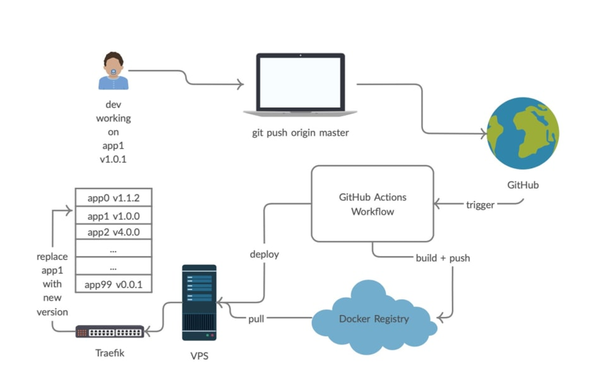
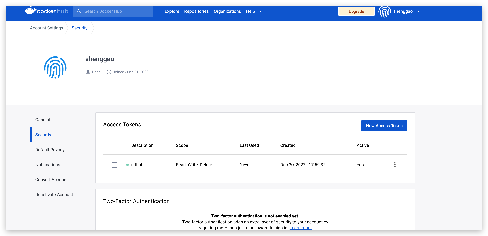
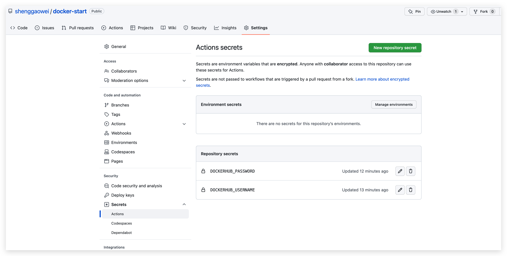

## 1 自动化流程
自动化构建和提交镜像


自动化部署


## 2 自动化流程

### 2.1 github actions 

[github action 文档地址](https://docs.github.com/zh/actions)

### 2.2 使用 github action 自动构建镜像并上传到 dockerhub 中

项目地址 https://github.com/shenggaowei/docker-start

在项目 .github/workflows 下创建 docker-build.yml 文件

```yml
name: Docker image build and push
on: [push]
jobs:
  Docker-Build-Push:
    runs-on: ubuntu-latest
    steps:
      - name: Check out repository code
        uses: actions/checkout@v2
      - name: docker image build
        run: docker image build -t shenggao/flask-demo:latest .
      - name: list docker image
        run: docker image ls
      - name: dockerhub login
        run: docker login -u ${{ secrets.DOCKERHUB_USERNAME }} -p ${{ secrets.DOCKERHUB_PASSWORD }}
      - name: push to dockerhub
        run: docker image push shenggao/flask-demo:latest
```

在 [dockerhub 网站](https://hub.docker.com/settings/security) 申请 access-token 代替密码。



在 github 项目的 settings -> secrets 中将 dockerhub 的用户名和 access-token 填进去。



push 代码，可在 actions 中看到自动构建的效果。


同时登陆 dockerhub，镜像已经被推送上去。

### 2.3 使用 buildx 方式构建多架构版本的镜像

修改 yml 文件

```yml
name: Docker image build and push
on: [push]
jobs:
  Docker-Build-Push:
    runs-on: ubuntu-latest
    steps:
      - name: Check out repository code
        uses: actions/checkout@v2

      - name: Set up QEMU
        uses: docker/setup-qemu-action@v2

      - name: Set up Docker Buildx
        id: buildx
        uses: docker/setup-buildx-action@v2

      - name: Avaliable platforms
        run: echo ${{ steps.buildx.outputs.platforms }}

      - name: build and push
        run: |
          docker login -u ${{ secrets.DOCKERHUB_USERNAME }} -p ${{ secrets.DOCKERHUB_PASSWORD }}
          docker buildx ls
          docker buildx build --push --platform linux/arm/v7,linux/arm64/v8,linux/amd64 -t shenggao/flask-demo:latest .

```

使用 QEMU action 添加在 ubuntu 中 docker 所缺失的模拟环境（具体是啥需要再去研究）。使用 buildx action 配置 buildx 环境，能够使用 buildx 进行构建。

https://github.com/marketplace/actions/docker-setup-buildx

https://github.com/marketplace/actions/docker-setup-qemu

### 2.4 使用 build and push docker images 进一步简化流程

https://github.com/marketplace/actions/build-and-push-docker-images

```yml
name: Docker image build and push
on: [push]
jobs:
  Docker-Build-Push:
    runs-on: ubuntu-latest
    steps:
      - name: Check out repository code
        uses: actions/checkout@v2

      - name: Set up QEMU
        uses: docker/setup-qemu-action@v2

      - name: Set up Docker Buildx
        id: buildx
        uses: docker/setup-buildx-action@v2
		
      - name: Avaliable platforms
        run: echo ${{ steps.buildx.outputs.platforms }}

      - name: Login to Docker Hub
        uses: docker/login-action@v2
        with:
          username: ${{ secrets.DOCKERHUB_USERNAME }}
          password: ${{ secrets.DOCKERHUB_PASSWORD }}

      - name: Build and push
        uses: docker/build-push-action@v3
        with:
          push: true
          platforms: linux/arm/v7,linux/arm64/v8,linux/amd64
          tags: shenggao/flask-demo:latest
```

### 2.5 部署。使用 ssh 连接服务器，拉取镜像，生成容器。

```yml
deploy:
    runs-on: ubuntu-latest
    needs: Docker-Build-Push
    steps:
      - name: Check out repository code
        uses: actions/checkout@v2
      - name: start server
        uses: appleboy/ssh-action@master
        with:
          host: ${{ secrets.REMOTE_HOST }}
          username: ${{ secrets.REMOTE_USER }}
          key: ${{ secrets.SERVER_SSH_KEY }}
          script: |
            if [[ -n $(docker ps -q -f "name=^flask-demo$") ]]; then
               echo "停掉旧的镜像 flask-demo"
               docker container stop flask-demo
               docker image rm shenggao/flask-demo:latest
            fi
            docker image pull shenggao/flask-demo:latest
            docker container run -d --rm -p 5000:5000 --name flask-demo shenggao/flask-demo:latest

```

服务器的 host 和用户名在 github 的 secrets 中进行配置。 SERVER_SSH_KEY 为服务器的 id_rsa 文件内容。

完整代码在 github https://github.com/shenggaowei/docker-start