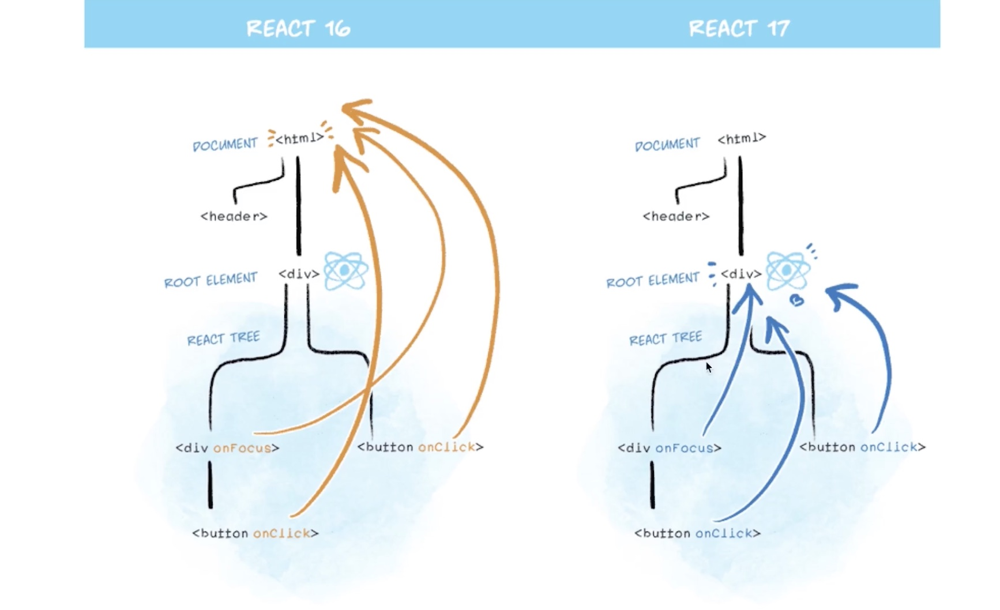

翻看 react 文档，记录一下 react 合成事件，了解以下几点。

1. 合成事件的概念和作用

2. 合成事件与原生事件的 3 个区别

3. 合成事件和原生事件的执行顺序

4. 合成事件的常见问题

## 一 相关概念

react 合成事件是 react 基于 w3c 标准，对原生事件做的封装。

那问题来了，react 为什么要封装合成事件呢？结合 react 官方文档，可以看出 react 的原因：

1. 不需要担心跨浏览器的兼容问题
2. 对事件的处理，通过事件委托机制冒泡到 root(react 17) 或者 document(react 16) 节点进行触发，减少内存消耗，避免频繁解绑，提高性能
3. 方便事件的同一管理（如事务机制）

## 二 和原生事件的区别

1. 事件命名方式不同。react 事件采用小驼峰(onClick)，不是纯小写。
2. jsx 语法需要传入一个函数作为事件处理函数，而不是一个字符串。
3. 不能通过返回 false 来阻止默认行为，必须使用 preventDefault。

```jsx
// react 写法
<button onClick={activateLasers}>
  Activate Lasers
</button>

// 原生写法
<button onclick="activateLasers()">
  Activate Lasers
</button>
```

## 三 合成事件和原生事件的执行顺序

如果同一个元素节点，既绑定了合成事件，又绑定了原生事件，那么执行顺序会是什么样呢？

写了个 demo，既有合成事件，又绑定了原生事件.

```jsx
import "./styles.css";
import React from "react";

export default function App() {
  const h1Click = React.useRef((e) => {
    console.log("h1=> click");
  });

  const documentClick = React.useRef(() => {
    console.log("document=> click");
  });

  const rootClick = React.useRef(() => {
    console.log("#root=> click");
  });

  React.useEffect(() => {
    const h1Ref = document.querySelector("h1");
    const rootRef = document.getElementById("root");
    document.addEventListener("click", documentClick.current);
    rootRef.addEventListener("click", rootClick.current);
    h1Ref.addEventListener("click", h1Click.current);
  }, []);

  const onReactClick = (e) => {
    console.log("react h1=> click");
  };

  return (
    <div className="App">
      <h1 onClick={onReactClick}>Hello CodeSandbox</h1>
      <h2>Start editing to see some magic happen!</h2>
    </div>
  );
}
```

在 react 17 中点击 h1 输出：

```log
h1=> click
react h1=> click
#root=> click
document=> click
```

在 react 16 中点击 h1 输出：

```log
h1=> click
#root=> click
react=> click
document=> click
```

输出结果不同，是因为 react 不同版本事件委托的对象不一致，16 为 document，17 为 root 节点。

结合官方文档和 demo，可总结出执行顺序：

1. 触发目标 dom 元素原生事件，冒泡到 root 节点。
2. 执行 root 节点上的 react 合成事件。
3. 执行 root 节点上的原生事件。
4. 向上冒泡执行原生事件。

## 三 合成事件的常见问题

1. react 17 为什么将事件绑定到 root?

   1. 有利于多个 react 版本并存，例如微前端。同时绑定到 document 上，会导致 react 版本混乱。

      

2. 阻止事件冒泡对 react 合成事件和原生事件的影响。

以 17 为例, 在合成事件中设置 e.stopPropagation(), 可以阻止合成事件的冒泡行为。但是由于事件本身都在 root 上执行，所以最多只能阻止事件从 root 向上层冒泡。

对代码进行修改，在元素点击的时候，阻止事件冒泡。

```jsx
import "./styles.css";
import React from "react";

export default function App() {
  const h1Click = React.useRef((e) => {
    console.log("h1=> click");
  });

  const documentClick = React.useRef(() => {
    console.log("document=> click");
  });

  const rootClick = React.useRef(() => {
    console.log("#root=> click");
  });

  React.useEffect(() => {
    const h1Ref = document.querySelector("h1");
    const rootRef = document.getElementById("root");
    document.addEventListener("click", documentClick.current);
    rootRef.addEventListener("click", rootClick.current);
    h1Ref.addEventListener("click", h1Click.current);
  }, []);

  // 新增阻止冒泡
  const onReactClickH1 = (e) => {
    e.stopPropagation();
    console.log("react h1=> click");
  };

  // 新增父节点事件处理
  const onReactClickApp = (e) => {
    console.log("react app=> click");
  };

  return (
    <div className="App" onClick={onReactClickApp}>
      <h1 onClick={onReactClickH1}>Hello CodeSandbox</h1>
      <h2>Start editing to see some magic happen!</h2>
    </div>
  );
}
```

执行输出：

在 react 17 中点击 h1 输出：

```log
h1=> click
react h1=> click
#root=> click
```

在 react 16 中点击 h1 输出：

```log
h1=> click
#root=> click
react h1=> click
document=> click
```
